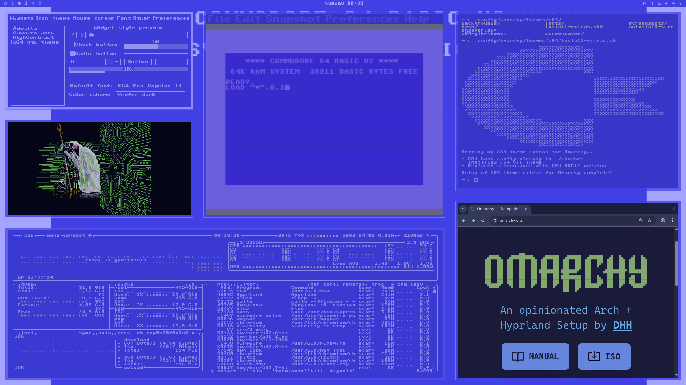

# Commodore 64 Theme for Omarchy
`omarchy-c64-theme`

I adore the Commodore 64, and if you do too, you may enjoy this theme for Omarchy. It's a fully-featured, retro-style throwback to the days of the C64, with its iconic double-blue palette, and chonky fonts.

## Installation

### Option 1

Use the built-in tool from the terminal: `omarchy-theme-install https://github.com/scar45/omarchy-c64-theme`

### Option 2

Copy `https://github.com/scar45/omarchy-c64-theme`, then open the main Omarchy menu and select `Install -> Style -> Theme` and paste the URL.

## Extras

_Run `./install-extras.sh` (after auditing of course!)_

- Bash splash text mimicking the C64 ram check (counts your actual RAM in bytes!)
		- Check `bash/c64rc` which adds some aliases as well
- Waybar font change
- Omarchy screensaver ascii change to Commodore logo
